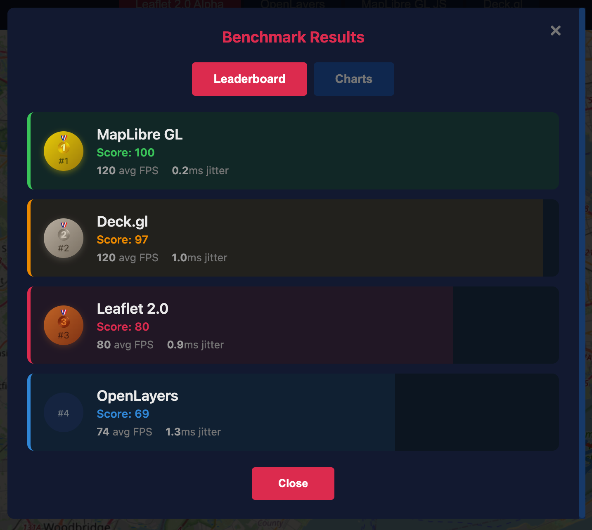

# Map Compare

A comparison demo app for evaluating four mapping libraries: **Leaflet 2.0 Alpha**, **OpenLayers**, **MapLibre GL JS**, and **Deck.gl**.

Uses fake GeoJSON data to demonstrate layer types, interactivity, and performance differences between Canvas (Leaflet, OpenLayers) and WebGL (MapLibre, Deck.gl) rendering approaches.

## Getting Started

```bash
npm install
npm run dev
```

Open http://localhost:3000

### Mobile Testing

```bash
npm run dev -- --host
```

Access from your mobile device at `http://[your-ip]:3000`

## Features

- **Layer Types:** Points, polygons, lines, heatmap, clusters
- **Dynamic Point Count:** 500, 1K, 5K, 10K points
- **Live Animation:** Stress-test rendering with animated points
- **Performance Benchmark:** Automated FPS comparison across all libraries
- **Code Comparison:** View implementation snippets side-by-side
- **Mobile-Friendly:** Bottom sheet controls with floating FPS badge

## Libraries Compared

| Library | Rendering | Approach |
|---------|-----------|----------|
| Leaflet 2.0 Alpha | Canvas | ES6 constructors |
| OpenLayers | Canvas | Class-based styles |
| MapLibre GL JS | WebGL | Style-spec JSON |
| Deck.gl | WebGL | Layer composition |

## Benchmark Results

WebGL libraries (MapLibre, Deck.gl) consistently outperform Canvas libraries (Leaflet, OpenLayers), especially at higher point counts and on constrained devices.



| Rank | Library | Score | Avg FPS | Jitter | Rendering |
|------|---------|-------|---------|--------|-----------|
| 🥇 | MapLibre GL | 100 | 120 | 0.2ms | WebGL |
| 🥈 | Deck.gl | 97 | 120 | 1.0ms | WebGL |
| 🥉 | Leaflet 2.0 | 80 | 80 | 0.9ms | Canvas |
| 4 | OpenLayers | 69 | 74 | 1.3ms | Canvas |

*Results from M3 Max MacBook Pro. See [CLAUDE.md](CLAUDE.md#benchmark-results-by-device) for results across different devices.*

### Methodology

The built-in benchmark measures actual frame time (not API call time) to accurately compare Canvas vs WebGL performance:

- 3 iterations per configuration
- 10 second test duration with 2 second warmup
- Randomized test order to reduce bias
- Median FPS and jitter metrics

## Development

```bash
npm run build    # Production build
npm run preview  # Preview production build
```

## License

MIT
